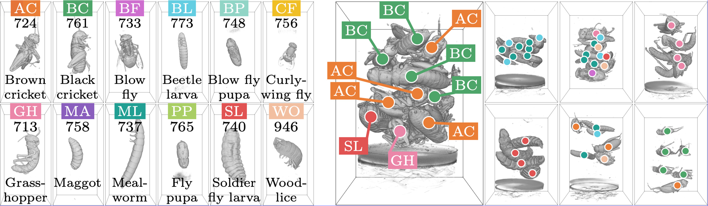
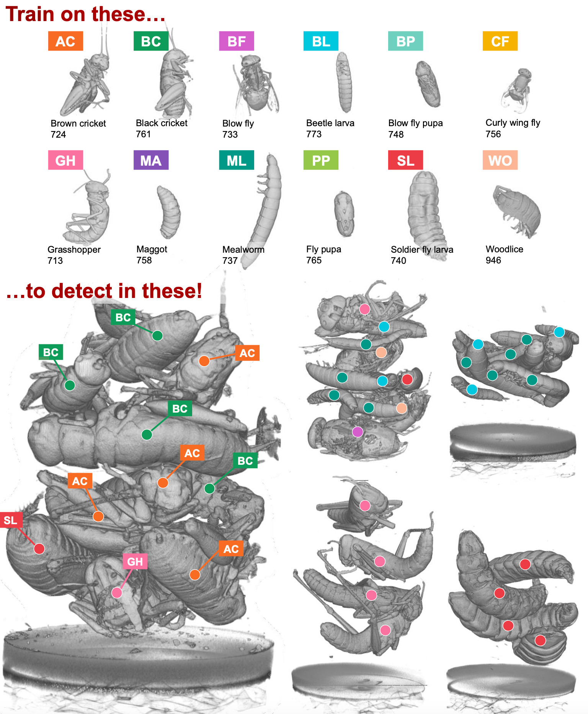

<meta name="google-site-verification" content="Lw-JRcJ9jX_vjJzv2CEG5vPr8HBFLr3oNU4SBgPtdUw" />

# BugNIST - dataset for volumetric analysis

The BugNIST dataset is created to advance methods for classification and detection in 3D. It contains 9542 volumes where 9154 are of individual bugs and 388 are mixtures of bugs and other material. There are 12 types of bugs including larvae, pupae, insects, and woodlice. 

In the BugNIST classification challenge, each volume containing a single bug must be classified as one of the 12 types. The original volumes are 900x450x450 voxels, and in addition, we provide the data at different resolutions by downscaling the original scans. 

aims to benchmark classification and detection methods, and we have designed the detection challenge such that detection models are trained on scans of individual bugs and tested on bug mixtures. Models capable of solving this task will be independent of the context, i.e., the surrounding material. In cases where the context is unknown or changing, this is a great advantage, which is commonly occurring in 3D µCT. 

## What is BugNIST?
BugNIST is a volumetric dataset for object detection and segmentation. BugNIST has several features:
-	Object detection in volumetric data
-	Segmentation in volumetric data
-	3D µCT scanning of 12 bug classes
-	9154 volumes of individual bugs
-	388 volumes of bug mixtures with center point annotations
-	Volume sizes: 900x450x450 (individual) and 900x650x650 (mixtures)
-   Data available in sizes: 
    - Original: 900x450x450 (individual) and 900x650x650 (mixtures)
    - Large: 512x256x256 (individual) and 512x370x370 (mixtures)
    - Medium: 256x128x128 (individual) and 256x185x185 (mixtures)
    - Small: 128x64x64 (individual) and 128x92x92 (mixtures)
    - Tiny: 64x32x32 (individual) and 64x46x46 (mixtures)

**People:**
- Anders Bjorholm Dahl, DTU Compute
- Patrick Møller Jensen, DTU Compute
- Vedrana Andersen Dahl, DTU Compute
- Carsten Gundlach, DTU Physics
- Rebecca Engberg, DTU Compute
- Hans Martin Kjer, DTU Compute

**Sponsors:** 
Novo Nordisk Foundation, Villum Foundation

**Research paper:** 
When publishing based on BugNIST, it is mandatory to cite the following publication: 
Jensen, P. M., Dahl, V. A., Gundlach, C., Engberg, R., Kjer, H. M., & Dahl, A. B. (2023). BugNIST - a Large Volumetric Dataset for Object Detection under Domain Shift. ECCV - The 18th European Conference on Computer Vision, October 2024, Milan, Italy.

**Tasks:** 
The task is illustrated here.

The task is to detect or segment bugs in the mixtures, but only using the scans of individual bugs. Therefore, the mixture scans should only be used for testing algorithm performance, and not for training. The motivation is that preparing data for detection and especially segmentation in volumes is difficult and will take an extremely long time, especially for objects with a complex shape like bugs. If objects can be scanned individually, then the annotation becomes almost trivial because the objects can be separated from the background based on voxel intensities. The challenge is that the bugs in mixtures are placed in a different context.

To test the performance of object detection, we have marked the center position of each bug in 388 mixture volumes.

